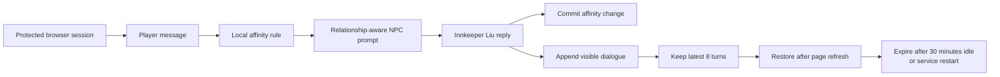

# Mortal Ascension

**An ordinary traveler. A whispered rumor. A path toward immortality.**

An original cultivation RPG with AI-driven NPC conversation. The current
playable chapter begins in **Tingyu Inn** in Qingshi Town. Approach
Innkeeper Liu, ask about nearby sects, and discover the first hints of the
cultivation world.

## Project showcase

Watch the gameplay demo, explore the complete technology stack, and see how
session memory, hidden affinity, and recoverable dialogue work together:

**[Open the Mortal Ascension project showcase](https://samguan2020.github.io/mortal-ascension/)**

## Current game

- Three.js with WebGPU and WebGL fallback.
- Custom skinned traveler and innkeeper models.
- Keyboard/gamepad movement and proximity-based conversation.
- FastAPI + HelloAgents with server-only model credentials.
- Password-protected same-origin cloud runtime.
- Innkeeper Liu keeps the latest 8 conversation turns per ephemeral session.
- Hidden deterministic affinity changes his tone without extra model calls.
- Session dialogue is restored after a page refresh and cleared on expiry or
  service restart.

## NPC Intelligence Showcase

Innkeeper Liu is more than a stateless chat endpoint. Within each protected
browser session, conversation context, relationship tone and the visible
dialogue history work together to make repeated interaction feel coherent.

| Feature | Player experience | Implementation boundary |
|---|---|---|
| **Session memory** | Liu can refer back to details from the latest conversation instead of treating every message as a first meeting. | Keeps the latest 8 successful turns per browser session. |
| **Hidden affinity** | Polite, trusting or hostile language changes how warmly Liu responds and how willing he is to share sensitive clues. | Deterministic local rules; no extra model call and no visible relationship meter. |
| **Recoverable dialogue log** | Refreshing the page restores the current conversation so the player can continue reading and asking questions. | Stores only player/NPC messages in server memory; no dialogue files, database or browser storage. |

### Try the memory

Tell Liu something, continue the conversation, then ask him to recall it:

> **Player:** Innkeeper, my name is Shen Yan. This is my first visit to Qingshi Town.<br>
> **Player, several turns later:** Do you remember my name?

The exact generated wording can vary, but Liu receives the recent conversation
as context and can answer consistently while the turn remains in the 8-turn
window.

### Change the relationship without a meter

Relationship changes remain intentionally invisible. The player reads them
through Liu's behavior:

| Player approach | Local change | Expected behavior |
|---|---:|---|
| "Thank you, Innkeeper. I trust you." | +3 | Warmer tone and greater willingness to explain |
| "Please, may I ask you something?" | +1 | Slightly more courteous response |
| Ordinary questions | 0 | Cautious hospitality toward a normal guest |
| "You are a liar." | -3 | More reserved, less forthcoming |
| Threats or severe insults | -8 | Guarded tone and refusal to share sensitive clues |

Only a successful NPC exchange commits the relationship change. Provider errors
and timeouts leave the session state untouched.

### Refresh and continue

After a successful exchange, refresh the page. The browser requests the current
session log and restores up to 8 turns in their original order. The log contains
only the two visible roles:

```json
[
  {"role": "player", "message": "Are there any sects nearby?"},
  {"role": "npc", "message": "Cultivators test spiritual roots near Qixia Mountain around the spring equinox, but you must judge true opportunity from rumor yourself."}
]
```

### Session lifecycle



All three systems are ephemeral by design. They are isolated by secure session
cookie, expire after 30 minutes of inactivity, reset when the service restarts or
scales to zero, and do not create a permanent player profile.

Detailed behavior and security boundaries:

- [Session memory](MEMORY_SYSTEM_GUIDE.md)
- [Hidden affinity](AFFINITY_SYSTEM_GUIDE.md)
- [Session dialogue log](DIALOGUE_LOG_GUIDE.md)

## Requirements

- Node.js 24 and npm.
- Python 3.12+; Python 3.13 also passes the local tests.
- Git.
- Azure CLI only for intentional cloud operations.

Open the repository directly in VS Code:

```powershell
code D:\Repos\mortal-ascension
```

## Install and test

Web dependencies:

```powershell
Set-Location D:\Repos\mortal-ascension\web
npm ci
npm test
npm run build
```

Cloud test dependencies:

```powershell
Set-Location D:\Repos\mortal-ascension
python -m venv .venv
.\.venv\Scripts\python.exe -m pip install -r cloud\requirements.txt httpx
.\.venv\Scripts\python.exe -m unittest `
  cloud.test_relationship_manager `
  cloud.test_server `
  tools.test_deploy_azure -v
```

These automated tests mock provider calls and do not incur model charges.

## Run locally with real AI dialogue

The local development path keeps model credentials in Python and binds both
servers to loopback. Manual dialogue uses the provider values in the private
`backend/.env` file and can incur model charges. Never commit or paste that file.

For an Azure OpenAI deployment, configure:

```dotenv
LLM_PROVIDER=azure_openai
LLM_API_VERSION=2024-12-01-preview
LLM_BASE_URL=https://<resource>.openai.azure.com/
LLM_MODEL_ID=<deployment-name>
LLM_API_KEY=<resource-key>
```

For another OpenAI-compatible provider, set
`LLM_PROVIDER=openai_compatible`, omit `LLM_API_VERSION`, and use that
provider's HTTPS v1 base URL. Azure mode uses `max_completion_tokens`;
OpenAI-compatible mode uses `max_tokens`. Both remain capped by the server's
256-token output limit.

Start the FastAPI backend in the first terminal:

```powershell
Set-Location D:\Repos\mortal-ascension
.\.venv\Scripts\python.exe tools\run_local.py
```

This reads only the documented `LLM_*` provider values, then listens on
`http://127.0.0.1:8000`. It does not probe the provider or spend tokens during
startup.

Start Vite in a second terminal:

```powershell
Set-Location D:\Repos\mortal-ascension\web
npm run dev
```

Open `http://127.0.0.1:5174`. Vite proxies `/api` and `/healthz` to the loopback
backend. The local API accepts only that exact frontend origin and uses an
HttpOnly, SameSite=Strict development cookie. Stop both servers with `Ctrl+C`.

Switching is automatic:

- The local Vite URL uses the loopback backend.
- The deployed Azure URL uses its same-origin protected cloud backend.
- Production still requires HTTPS, Basic authentication and Secure cookies.

If the game reports that it could not get a reply, first confirm both terminals
are still running. Then open `http://127.0.0.1:8000/healthz`; `{"status":"ok"}`
confirms only that the local API is running. Provider authorization or quota
errors appear only after a real dialogue request.

## Mocked browser walkthrough

Start Vite without the local backend:

```powershell
Set-Location D:\Repos\mortal-ascension\web
npm run dev -- --port 5174 --strictPort
```

Open `http://127.0.0.1:5174`. Without `tools\run_local.py`, manual dialogue shows
a service warning, while the walkthrough below still passes because it mocks API
requests.

In another terminal, run the mocked Playwright walkthrough:

```powershell
Set-Location D:\Repos\mortal-ascension
python web\test_browser.py --base-url http://127.0.0.1:5174
```

Stop Vite with `Ctrl+C` after testing.

## Project layout

| Path | Purpose |
|---|---|
| [web/](web/) | Current Three.js/Vite browser client and Web tests |
| [cloud/](cloud/) | Protected FastAPI runtime, Docker build and API tests |
| [backend/](backend/) | Shared Innkeeper Liu prompt and deterministic affinity rules |
| [assets/source/](assets/source/) | Editable Blender characters and reusable motion sources |
| [tools/asset-pipeline/](tools/asset-pipeline/) | Character generation and validation tools |
| [tools/](tools/) | Azure deployment and verification tools |
| [design/](design/) | Current art, UX, asset and opening-chapter specifications |
| [docs/](docs/) | Current architecture, collaboration and deployment documentation |
| [.github/](.github/) | Local Copilot agents, skills, instructions and CI |

## Cloud deployment

The cloud runtime requires HTTPS and Secure cookies. See the
[Azure deployment guide](docs/azure-deployment.md). Existing Azure resource
names are compatibility identifiers; do not create or redeploy resources without
explicit authorization.

## Repository safety

- `.env`, virtual environments, dependencies, builds and runtime data are
  gitignored.
- `backend/.env` remains a private compatibility input for the deployment tool;
  never commit or expose it.
- Editable `.blend` sources and final browser `.glb` assets are intentionally
  both retained.
- No Git remote is currently configured.

## Licenses

Development-agent tooling is adapted from Donchitos' open-source Game Studios
tooling. Its MIT notice is preserved in
[.github/STUDIO-LICENSE](.github/STUDIO-LICENSE).

Required third-party attribution and license terms are listed in
[THIRD_PARTY_NOTICES](THIRD_PARTY_NOTICES).
